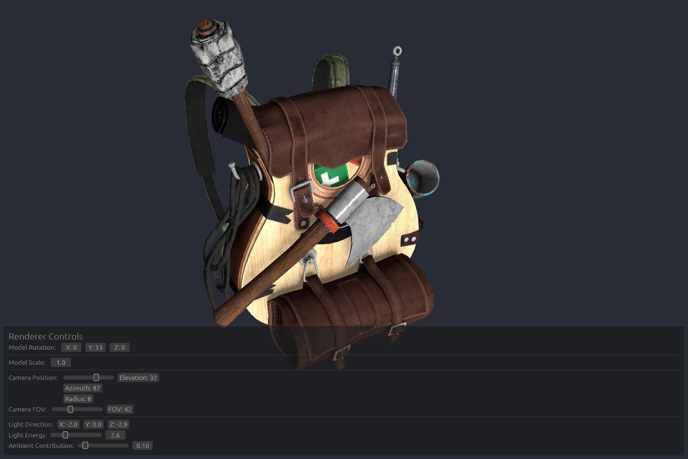

# Basic WGPU Renderer

Basic Blinn-Phong 3D renderer sample project built with [WGPU](https://github.com/gfx-rs/wgpu), [winit](https://github.com/rust-windowing/winit), and [egui](https://github.com/emilk/egui).  

Feel free to use as a WGPU template to build your own renderer, so you don't have to go through the same graphics API boilerplate like me :)  



Demo model: **Survival Guitar Backpack** by [Berk Gedik](https://sketchfab.com/berkgedik)  

### Running

**Default (Off-screen Render):**  

```
cargo run --release
```

**Windowed (Real-time Render):**  

```
cargo run --release -- -w
```

**Loading Custom Model Using `-m`:**  

```
cargo run --release -- -w -m "your_model_folder/model.obj"
```
